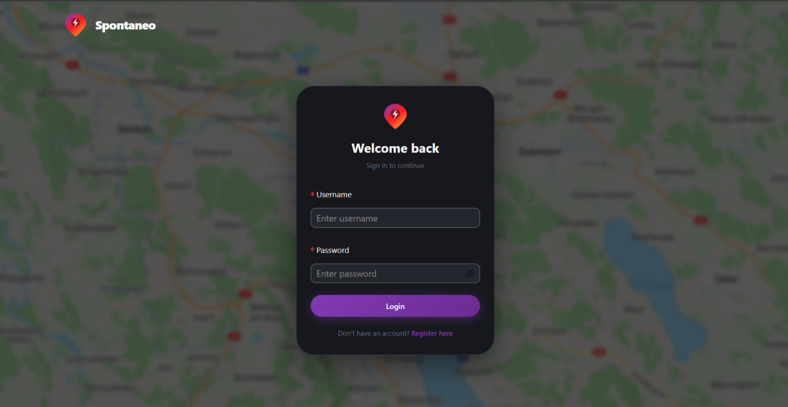
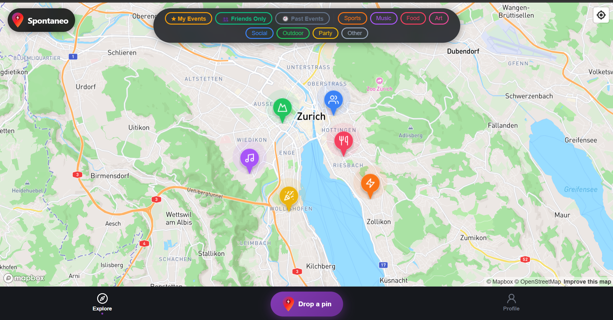
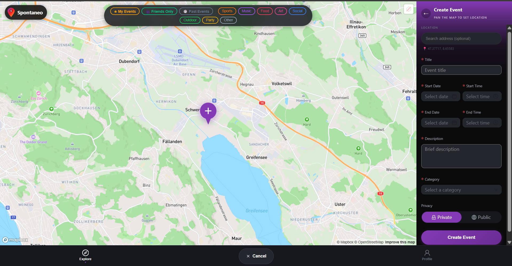

# 📌Sponatneo - SoPra FS26 Group 21 · Backend

## Introduction

Spontaneo is a **location-based event discovery app** that allows users to open a map, instantly see what’s happening nearby, and join events in real time. Public events can be joined with a single click, while private events require an 8-character invite code shared by the organizer. Each event includes a real-time chat powered by STOMP/SockJS and a collaborative board where participants can share photos, comments, and emoji reactions. After an event ends, attendees can rate the organizer.

The platform aims to bridge the gap between traditional social-network events — which usually assume users already know the host — and impersonal event-listing platforms. By centering everything around a live map, proximity-based discovery, and a lightweight social graph, Spontaneo makes discovering and joining spontaneous local activities feel more natural and social.

This repository contains the **Spring Boot 4 / Java 17 backend** deployed on **Google Cloud App Engine Standard** with a **Cloud SQL Postgres** database. The Next.js frontend lives in [`sopra-fs26-group-21-client`](https://github.com/claudioo2/sopra-fs26-group-21-client).

---

## Technologies used

- **Spring Boot 4** · **Java 17** · **Spring Data JPA** · **MapStruct** for DTO ↔ entity mapping
- **Spring WebSocket** with **STOMP over SockJS** (App Engine Standard blocks raw WebSocket upgrades)
- **PostgreSQL** via **Google Cloud SQL** (`db-f1-micro`) in production; **H2 in-memory** in dev / tests
- **Gradle** (Wrapper, no system install needed) · **JUnit 5** · **Mockito** · **JaCoCo** · **SonarCloud**
- **Google Cloud App Engine Standard** (Java 17 runtime, `F4` instance class, scale-to-zero)
- **GitHub Actions** for CI/CD

---

## High-level components

1. **REST + WebSocket controllers** — [`controller/`](./src/main/java/ch/uzh/ifi/hase/soprafs26/controller/) — entry points for HTTP and STOMP traffic. The main classes are [`UserController`](./src/main/java/ch/uzh/ifi/hase/soprafs26/controller/UserController.java), [`EventController`](./src/main/java/ch/uzh/ifi/hase/soprafs26/controller/EventController.java), [`MessageController`](./src/main/java/ch/uzh/ifi/hase/soprafs26/controller/MessageController.java), [`PostController`](./src/main/java/ch/uzh/ifi/hase/soprafs26/controller/PostController.java), and [`RatingController`](./src/main/java/ch/uzh/ifi/hase/soprafs26/controller/RatingController.java). They translate HTTP requests into service calls and return DTOs through [`DTOMapper`](./src/main/java/ch/uzh/ifi/hase/soprafs26/rest/mapper/DTOMapper.java). Token-based auth is wired through a custom `@AuthenticatedUser` annotation in [`authentication/`](./src/main/java/ch/uzh/ifi/hase/soprafs26/authentication/) so controllers receive the resolved `User` directly.

2. **Domain services** — [`service/`](./src/main/java/ch/uzh/ifi/hase/soprafs26/service/). [`EventService`](./src/main/java/ch/uzh/ifi/hase/soprafs26/service/EventService.java) creates events (auto-adds the creator as participant, generates a unique 8-character invite code), filters by Haversine radius, **soft-deletes** by setting `cancelledAt`, and runs the hourly `@Scheduled` cleanup that hard-deletes events past their 24 h grace window. [`MessageService`](./src/main/java/ch/uzh/ifi/hase/soprafs26/service/MessageService.java) enforces participant membership and the grace-period chat rules. [`UserService`](./src/main/java/ch/uzh/ifi/hase/soprafs26/service/UserService.java) handles registration, login, the self-referencing follow graph, and partial updates. [`ParticipantService`](./src/main/java/ch/uzh/ifi/hase/soprafs26/service/ParticipantService.java), [`PostService`](./src/main/java/ch/uzh/ifi/hase/soprafs26/service/PostService.java), and [`RatingService`](./src/main/java/ch/uzh/ifi/hase/soprafs26/service/RatingService.java) round out the domain.

3. **JPA entities** — [`entity/`](./src/main/java/ch/uzh/ifi/hase/soprafs26/entity/). [`User`](./src/main/java/ch/uzh/ifi/hase/soprafs26/entity/User.java), [`Event`](./src/main/java/ch/uzh/ifi/hase/soprafs26/entity/Event.java) (with `cancelledAt` for soft-delete), [`Message`](./src/main/java/ch/uzh/ifi/hase/soprafs26/entity/Message.java), [`Post`](./src/main/java/ch/uzh/ifi/hase/soprafs26/entity/Post.java), and [`Rating`](./src/main/java/ch/uzh/ifi/hase/soprafs26/entity/Rating.java) (`UNIQUE(rater_id, event_id)` enforces one rating per user per event). Relationships: a `User` is creator of and participant in many `Event`s; an `Event` aggregates `Message`s, `Post`s, and `Rating`s.

4. **WebSocket configuration** — [`config/WebsocketConfig.java`](./src/main/java/ch/uzh/ifi/hase/soprafs26/config/WebsocketConfig.java). Registers `/ws` with `.withSockJS()`, a simple in-memory broker on `/topic`, and the `/app` prefix for application routes. Two broadcasts exist today: `/topic/chat/{eventId}` (every saved message) and `/topic/events/{eventId}/cancelled` (one frame when the creator soft-deletes an event).

5. **Infrastructure / persistence config** — [`Application.java`](./src/main/java/ch/uzh/ifi/hase/soprafs26/Application.java) (CORS, `@EnableScheduling`, root health-check), [`app.yaml`](./app.yaml) (App Engine runtime + Cloud SQL socket), and [`application-prod.properties`](./src/main/resources/application-prod.properties) (Postgres URL via the Cloud SQL socket factory, HikariCP capped at 5 connections per instance).

The controllers depend on the services, which depend on Spring Data JPA repositories ([`repository/`](./src/main/java/ch/uzh/ifi/hase/soprafs26/repository/)) that talk to either H2 (dev) or Cloud SQL Postgres (prod) depending on the active Spring profile.

---

## Launch & Deployment

### Prerequisites

- **Java 17** (ensure `JAVA_HOME` points to it on Windows).
- No additional install required — the **Gradle Wrapper** (`./gradlew`) bootstraps everything else.

### IDE setup

**IntelliJ IDEA** — a free educational licence is at [jetbrains.com/community/education](https://www.jetbrains.com/community/education/#students):
1. **File → Open** → select the `sopra-fs26-group-21-server` folder
2. Accept the prompt to import as a Gradle project
3. Right-click `build.gradle` → **Run Build**

**VS Code** — install:
- `vmware.vscode-spring-boot`
- `vscjava.vscode-spring-initializr`
- `vscjava.vscode-spring-boot-dashboard`
- `vscjava.vscode-java-pack`

Build via the Gradle Tasks panel, then start the server from the Spring Boot Dashboard.

### Run locally

```bash
./gradlew bootRun                      # start server at http://localhost:8080
./gradlew build --continuous -xtest    # watch mode (rebuilds on file change, skips tests)
```

For watch mode, run `./gradlew build --continuous -xtest` in one terminal and `./gradlew bootRun` in a second.

**H2 console (dev only):** `http://localhost:8080/h2-console`
- JDBC URL: `jdbc:h2:mem:testdb`
- Username: `sa` / Password: *(leave blank)*

The dev database is in-memory and resets on every restart. Production uses Cloud SQL Postgres (see [Releases](#releases) below).

### Build, test, coverage

```bash
./gradlew build                                  # compile, test, and package
./gradlew test                                   # run all tests
./gradlew test jacocoTestReport                  # tests + JaCoCo coverage report
./gradlew sonar                                  # SonarCloud analysis
./gradlew test --tests "ch.uzh.ifi.hase.soprafs26.service.UserServiceTest"   # single test class
```

The test suite (16 classes under [`src/test/`](./src/test/)) covers services, controllers, the JPA layer, and the MapStruct mapper. CI runs `./gradlew build` on every push to `main` and on every pull request via [`.github/workflows/pr.yml`](./.github/workflows/pr.yml).

### Debugging

1. Start the server with the debug agent attached:
   ```bash
   ./gradlew bootRun --debug-jvm
   ```
2. In your IDE, add a **Remote JVM Debug** run configuration (default port `5005`).
3. Launch and set breakpoints as needed.

### External dependencies

- **Local dev**: none — H2 runs in-process.
- **Production**: a Google **Cloud SQL Postgres** instance (`sopra-fs26-group-21-server:europe-west6:sopra-fs26-db`) and a Google **App Engine Standard** app in the same project. The Cloud SQL password is injected at deploy time via the `DB_PASSWORD` env var.

### API testing

Use [Postman](https://www.postman.com/) or any HTTP client against `http://localhost:8080`. All protected endpoints require an `Authorization: Bearer <token>` header obtained from `POST /users/login`. The full route table is documented in [`CLAUDE.md`](../CLAUDE.md) at the root of the repository.

### Releases

Push to `main` → GitHub Actions runs [`.github/workflows/main.yml`](./.github/workflows/main.yml), which:

1. Builds the JAR with `./gradlew build`.
2. Substitutes the real Cloud SQL password into [`app.yaml`](./app.yaml) (the file in the repo carries a `REPLACE_ME_BEFORE_DEPLOY` placeholder).
3. Deploys to App Engine Standard with `gcloud app deploy`.

App Engine is configured to **scale to zero** (`min_instances: 0`, `max_instances: 1`, `F4`). The first request after idle pays a cold start of ~3–5 s; the client mitigates this by sending a warm-up `GET /users` while the user is typing on the login page. HikariCP is capped at 5 connections per instance to stay safely under Cloud SQL `db-f1-micro`'s 25-connection limit.

---

## Illustrations

The client has four main user flows. They are entered after the initial login / register screens (which can be reached via the homepage).

<div align="center" style="margin-bottom: 50;">
    
    <br>
    Register page
</div>

<br>

<div align="center">
    
    <br>
    Login page
</div>

### 1. 🗺️ Map exploration → join an event

```
/login  →  /map
          ├─ donut clusters group nearby events by category
          ├─ click a cluster → zoom in or spiderfy
          ├─ click a pin → event detail modal
          └─ modal: "Join" button (public) or invite-code prompt (private)
```

The map opens immediately on Zurich while geolocation resolves in the background, then `flyTo`s the user's position once `navigator.geolocation` succeeds (3-second timeout). Filter toggles (category, Friends-Only, My Events, Past Events) persist in `sessionStorage` so a refresh does not reset the view.

<div align="center">
    
    <br>
    Map page
</div>

<br>

You can select the pins to view the events. Depending on your role as creator, participant or non-participant, the event view will appear differently:

<div align="center">
    
    <br>
    If you are looking for an event to partcipate then you can join through the "Join Event" button
</div>

### 2. 📅 Create an event

```
/map  →  right-side "Create event" panel
          ├─ Mapbox Geocoding search (500 ms debounce) for the address
          ├─ green pin overlay = submitted coordinates
          └─ POST /events  →  new pin appears for everyone on next moveend
```
If you want to create an event then you can click on the "Drop a pin" button which is located in the middle of 
the navigation bar (at the bottom of the map page). This will open a creation form and a pin that can be dropped on the
desired location.

The creator is auto-added as the first participant, and the server generates a unique 8-character invite code visible only to them.

<div align="center">
    
    <br>
    To create an event, set the position of the event and fill out the creation form
</div>

### 3. 💬 Real-time chat

```
event modal  →  "Open chat"
                ├─ REST: GET /events/{id}/messages  (history)
                ├─ STOMP/SockJS connect on /ws
                ├─ subscribe /topic/chat/{eventId}
                └─ publish /app/chat/{eventId}  (token in body)
```
The chat can be found on the event-view and by clicking on the "Join Chat" button.

The chat survives a soft-delete: when the organizer cancels an event the row is kept for **24 hours** so participants can still coordinate. After that the cleanup job hard-deletes the event.

<div align="center">
    
    <br>
    Chat with other participants in real-time
</div>

### 4. 👤 Profile, follow, rate

```
/users/[id]
  ├─ Follow / Unfollow toggle (other users)
  ├─ View Following / View Followers modals
  ├─ Join by invite code
  ├─ Upcoming events list (cancelled events get a red badge)
  └─ Rate the organizer (visible only after the event ends)
```
The profile page, which can be reached by clicking on the profile icon on the navigation bar, appears different depending
on the user (if it's you or some other user). There you can follow and unfollow other users, see their events and ratings, 
edit your account, and join events through shared invitation codes. 

Ratings are 1–5 stars, one per (user, event) — the DB enforces a `UNIQUE(rater_id, event_id)` constraint and a second submission returns `409`.

<div align="center">
    
    <br>
    Profile page (own profile)
</div>

<br>

<div align="center">
    
    <br>
    Profile Page (profile of a friend)
</div>

---

## Roadmap

The top features new contributors could pick up next:

1. **Push-style event updates beyond cancellation.** The cancellation broadcast on `/topic/events/{eventId}/cancelled` proves the pattern works; the same channel could be reused for participant joins/leaves, photo posts, and rating submissions so the client no longer needs to poll on `moveend`.
2. **Server-side persistence for ratings on `User`.** Today `averageRating` and `ratingCount` are recomputed on every `GET /users/{id}` by [`RatingService`](./src/main/java/ch/uzh/ifi/hase/soprafs26/service/RatingService.java). With Cloud SQL this is fine at our scale, but caching the aggregate on `User` (denormalised, updated on `POST /events/{id}/ratings`) would remove the per-request scan.
3. **Refresh tokens / token expiry.** Tokens are currently long-lived random UUIDs persisted on `User`. Adding an expiry field plus a refresh endpoint would close the obvious security gap without changing the client's auth model significantly.

---

## Authors and acknowledgment

Group 21, FS26, University of Zurich — SoPra (Software Engineering Lab):

- **[@claudioo2](https://github.com/claudioo2)**
- **[@GabrielVuattoux](https://github.com/GabrielVuattoux)**
- **[@fra-a11y](https://github.com/fra-a11y)**
- **[@Pascal-Trautmann](https://github.com/Pascal-Trautmann)**
- **[@semirIbra](https://github.com/semirIbra)**

Many thanks to the SoPra teaching team and our TA for guidance throughout the semester. The project bootstrap is based on the official [`sopra-fs26-template-client`](https://github.com/HASEL-UZH/sopra-fs26-template-client) from the HASEL group at UZH.

---

## License

Licensed under the **Apache License 2.0** — see the [`LICENSE`](../sopra-fs26-group-21-server/LICENSE) file in the server repository for the full text.
